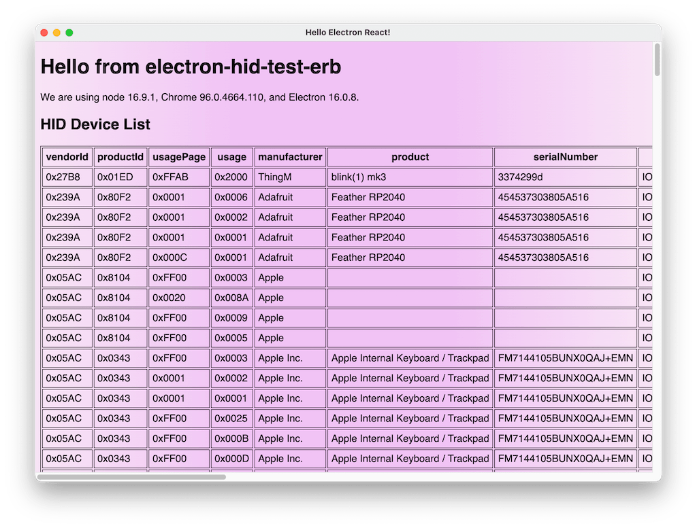

# electron-hid-test-erb :

Show how to use `node-hid` with `electron-react-boilerplate`

This is just a simple clone of the [electron-react-boilerplate](https://github.com/electron-react-boilerplate/electron-react-boilerplate)
repo, with the small additions needed to make [`node-hid`](https://github.com/node-hid/node-hid/) work,
as outlined in [ERB's Native Modules section](https://electron-react-boilerplate.js.org/docs/native-modules).

`node-hid` is shown both running in the "main" process and in the "renderer" process.


## Install and Run in 'dev'

Clone the repo and install dependencies:

```bash
npm install
npm start
```

**Having issues installing? See ERB's [debugging guide](https://github.com/electron-react-boilerplate/electron-react-boilerplate/issues/400)**


## Packaging for Production

```bash
npm run package
```


## Docs

See electron-react-boilerplate [docs and guides here](https://electron-react-boilerplate.js.org/docs/installation)



